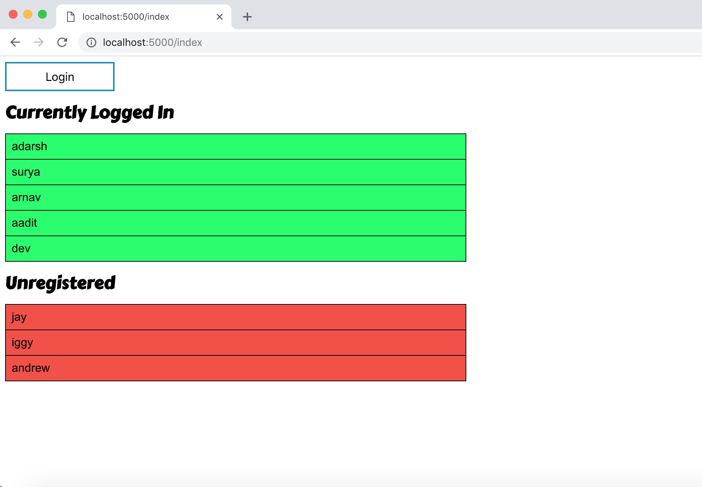

# checkin
A minimalist attendance tracker

## 🛠 Installation

Download Dependencies
 - python3 (``brew install python3``)
   - flask (``pip3 install flask``)

Download Source Code
 - ``git clone https://www.github.com/AaditT/checkin``)
 
 ## 🔑 Usage
 - Running the web server: ``python3 main.py YOUR_PASSWORD_HERE``
   - The password will be the token which allows attendees to login
